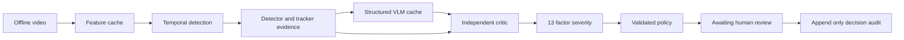

# ARGUS project guide


# Setup and operation

Use Python 3.12 and Node.js 22. CPU execution is sufficient for the included sample. Keep the project in a writable local directory. All paths in application records are relative to the project root. `ARGUS_ROOT` can override the inferred root when installing elsewhere.

## Windows commands

```powershell
python -m venv .venv
.\.venv\Scripts\python.exe -m pip install -e '.[dev]'
cd apps\console
npm.cmd ci
cd ..\..
.\.venv\Scripts\python.exe -m argus.cli schema
cd apps\console
npm.cmd run types
cd ..\..
.\.venv\Scripts\python.exe -m argus.cli demo
cd apps\console
npm.cmd run build
cd ..\..
.\.venv\Scripts\python.exe -m argus.cli serve
```

Open http://127.0.0.1:8000. The OpenAPI documentation is at http://127.0.0.1:8000/docs. The server binds to loopback by default. A development frontend can run separately with `npm run dev`, proxying `/api` and WebSockets to port 8000.

## First review

Open the counter scene. Expand the rejected knife claim. Its reason records the missing supporting detection. Use the comparison checkbox to inspect the authored raw output, then return to the verified ledger. Select a severity factor to highlight its supporting claims. The reference weights are uncalibrated; low scores are not safety assurances. Enter an operator name and confirm, or enter a note and dismiss. Open Audit trail to see the decision.

## Starting and stopping

`start.ps1` regenerates sample outputs and starts the server. Existing decisions remain in SQLite. Repeated pipeline runs create distinct incident records. Ctrl+C stops the server. Never delete `data/argus.sqlite` if its audit or annotation data must be retained. Back up the database using SQLite backup tooling or with the server stopped.

## Offline fallback

The built `apps/console/dist` contains JavaScript, CSS, synthetic clips and JSON. Serve it using `python -m http.server 8080 --directory apps/console/dist`, then open `http://127.0.0.1:8080/?demo=1`. Direct `file://` opening is not supported because the console loads JSON using fetch. The Gradio fallback requires `pip install -e '.[gradio]'` and `python apps/gradio_fallback/app.py`.

## Troubleshooting

If the screen says Disconnected, check the API terminal and `/api/health`. Build the frontend before starting the API because static mounting is configured at startup. If source TypeScript changes, rebuild and restart. Browser-compatible synthetic previews are WebM; MP4 analysis files remain in the sample directory. For missing research weights or language caches, use the commands in Research workflows. CUDA is optional. Set `--device cpu` for research scripts on a machine without CUDA.

The Docker recipe is a packaging option and has not been run on this machine. It bootstraps the synthetic sample before binding port 7860. Map it to loopback with `docker run -p 127.0.0.1:7860:7860 argus`. Do not expose operator writes publicly without authentication, authorization, storage protection and deployment-specific origin configuration.


# System architecture

ARGUS uses one versioned Pydantic IncidentRecord. Each module owns one stage. Strict models reject extra keys and validate confidence ranges, claim identifiers and time ordering. Language output cannot contain top-level severity or response fields.



## Module contracts

M1 decodes video, resamples at 25 frames per second and groups 16 frames per snippet. Each snippet spans 0.64 seconds, not one second. Research extraction averages frozen CLIP frame features. The synthetic mode computes a small pixel vector plus motion. Cache keys include the source content hash, extractor name and preprocessing configuration. Sidecar JSON describes dimensions and temporal spacing.

M2 uses a four-layer temporal transformer with sinusoidal position encoding, snippet attention, LayerNorm and a Multiple Instance Learning objective. Top-k pooling, a bounded erasing loss, sparsity and smoothness regularization operate on video-level binary labels. Validation loss chooses the checkpoint. Real mode requires a checkpoint and emits a binary anomaly score with class Unclassified. Sample mode uses an explicitly named motion baseline. The current localizer returns the envelope of threshold crossings, which may bridge disjoint events.

M3 only visits the candidate window. Synthetic scenes use actual pixel segmentation; research mode loads DETR. Greedy one-to-one IoU association maintains clip-local track IDs with an age limit. Counts are maximum simultaneous detections, avoiding the mistaken equation of track fragments with unique people. Keyframes maximize detection density and motion subject to temporal spacing. Occlusion, detector misses and ID switches remain limitations.

M4 loads structured claims from a validated cache. The optional Qwen job constrains decoding through a JSON grammar, rejects schema violations and retries parsing at most twice after the first generation. A separate critic-triggered retry consumes at most one explicitly supplied retry cache. Both attempts remain in the record. The critic does not receive the generation prompt.

M5 checks the sentence and entity metadata, maps curated aliases, uses one-way hypernym support, checks simultaneous counts within the claimed interval, and rejects claims outside the detection window. Only a deliberately narrow presence/count sentence grammar can receive VERIFIED. Intent, movement, interactions, property damage and other uncheckable semantics are downgraded. The rule-based vocabulary is limited; it is not a complete natural-language entailment system. Critic decisions never add claim text.

M6 reads only VERIFIED OBSERVATION claims and their referenced detections. Rejected, inferred and uncertain claims contribute nothing. Six factors have automatic support; seven context or event factors are unavailable and remain zero with availability metadata. The score is the sum of nonnegative contributions, clipped at 100. Until a fit is supplied, reference weights are explicitly uncalibrated. The fitting tool uses fixed ordered cut points and a cumulative logistic objective plus score error, nonnegative weights and a total-weight cap. Human ratings and pipeline-extracted factors must be split before fitting.

M7 looks up the incident class and severity band, falls back to a generic policy for unclassified events, then validates against exactly twelve action tokens. Violation counts record invalid proposed tokens before stripping. A valid token does not establish that a recommendation is appropriate. No action executor exists.

## Persistence and failure behavior

SQLite stores records and independent annotation sessions. Confirm and dismiss require an operator identifier; dismiss also requires a note. A transaction updates state and appends a chained-hash audit entry. Triggers reject SQL updates and deletes to audit rows. This detects many accidental changes but does not resist an administrator replacing the database or dropping triggers. Research failures stop with explicit errors. Missing checkpoints never silently select the sample pipeline.


# API reference

Start the local API with `python -m argus.cli serve`. Interactive OpenAPI documentation is available at `http://127.0.0.1:8000/docs`. The checked-in `apps/console/openapi.json` generates the TypeScript client types with `npm run types`.

| Method and path | Purpose |
| --- | --- |
| GET /api/health | Read service status and version |
| GET /api/incidents | List persisted incident records |
| GET /api/incidents/{id} | Read a complete incident |
| POST /api/incidents/{id}/decision | Confirm or dismiss with operator and note |
| GET /api/audit | Read the chronological decision audit |
| GET /api/config | Read the 13 factors and 12 allowed actions |
| GET /api/metrics | Read measured sample and existing research results |
| GET /api/annotations?annotator=name | Resume that local annotation session |
| PUT /api/annotations | Save or complete an independent annotation |
| GET /api/adjudication | Read completed annotations for comparison |
| GET /api/media/{relative_path} | Serve allowed sample, evidence or registered video files |
| WS /api/runs/{sample_clip_id} | Execute a sample and stream stage progress |

## Decision body

```json
{"decision":"dismiss","operator":"reviewer-1","note":"Evidence insufficient after review"}
```

The identifier must exist. Dismissal requires a note. A decision can occur once. Invalid input returns 422, a missing incident returns 404, and an already-decided record returns 409. Decision and audit insert share one database transaction. The record's recommended action set is logged, but the API never performs those actions.

## WebSocket events

Stage messages contain `module`, `status`, timing and the current record where available. The terminal message has `status: finished` and the completed record. An error message uses `status: error` and a descriptive `message`. Research model execution is intentionally a CLI batch workflow; the interactive WebSocket accepts bundled sample IDs.

## Local trust boundary

The service binds to loopback by default. Browser writes and sockets accept only the documented local ports. These origin checks reduce cross-site requests but do not provide authentication. Local clients without an Origin header can use the API. Session names are labels, not authenticated accounts. Network deployment requires its own authentication and authorization design.

The media endpoint resolves paths, checks permitted locations or exact registered video paths, and restricts file extensions. SQLite triggers prevent ordinary update or delete statements against audit rows. A database owner can still alter the database; this is an application audit trail, not immutable external storage.


# Data formats

## Unified dataset index

Place `index.csv` beside each manually obtained dataset and run its fetcher. Required columns are `clip_id,source_dataset,split,label,category,duration_s,fps,path_video,path_features,has_captions,has_sirb_labels`. Splits are train, val, test or demo. Labels are binary 0 or 1. Paths are relative to the project root. Features are finite float32 arrays with shape [snippets, dimension], loaded with pickle disabled. Optional `expected_severity` supports stratification. The index writer preserves extra evaluation columns.

Frame evaluation additionally requires `path_frame_labels` pointing to a binary NumPy vector with one entry per source frame, and `snippet_s` giving the feature interval in seconds. Do not substitute video-level labels. CLIP extraction here uses 16 frames at 25 fps, so snippet_s is 0.64. Pre-released I3D arrays may have different spacing or crop axes; convert them explicitly and record the transformation.

## Pair evaluation files

Localisation accepts a JSON array of `{clip_id, predicted: [start,end], truth: [start,end]}`. Severity and inter-annotator evaluation accept `{clip_id, a, b}` rows; severity requires `split: "test"`. Values `a` and `b` are score pairs in 0–100. Undefined correlation or agreement for constant labels returns null rather than a fabricated zero.

Severity fitting accepts `{clip_id, split, score, pipeline_factors, sample}` records. `pipeline_factors` must provide all thirteen factor names in the configured order with values between 0 and 1. `sample: true` forces the fitted model to say SYNTHETIC FIT ONLY. Train and test must be disjoint. The intended source of pipeline factors is `m6_severity.factors[].raw` joined to independent human ratings.

## VLM manifest

A JSON array with `clip_id` and `evidence_path` entries drives the offline batch. Each evidence path points to an Evidence schema JSON containing local keyframe paths. Model cache files contain only `claims`. Every claim requires `claim_id`, `text`, `type`, `entities`, `time_span_s`, `self_confidence` and an optional structured predicate/count map. Consult the generated OpenAPI schema rather than retyping interfaces.

## Ablations

`scripts/eval/ablations.py` expects rows with `variant, clip_id, n_claims, n_rejected`. Required variants are 7b_evidence_critic, 7b_no_evidence_critic, 3b_evidence_critic and 7b_evidence_no_critic. The same clip IDs must appear exactly once per variant. For the no-critic variant, use independently scored unsupported claims; simply setting rejection count to zero would conceal errors. Current tooling aggregates counts; it does not manufacture missing variant runs.


# Research workflows

## Data acquisition

Run `python -m argus.cli data`. Each dataset either downloads with a trusted expected SHA256 or prints precise manual instructions. Official pages and mutable download links live in `configs/data_sources.yaml`. A locally computed checksum records bytes; without a trusted expected checksum it is labelled RECORDED_NOT_AUTHENTICATED. Gated archives are not downloaded by bypassing consent. Use `docs/DATA_FORMATS.md` to prepare the unified index.

## Detector training and held out evaluation

Install optional research dependencies with `pip install -e '.[research]'`. Prefer pre-released I3D or CLIP features and set input dimensions from actual arrays. Do not mix feature families in one checkpoint. Split by source video, with no adjacent source windows in different splits. The training script rejects duplicate clip IDs across splits, but the dataset creator must provide original-video group IDs and check semantic duplicates.

```sh
python scripts/train/detector.py --index data/index/ucf_crime.parquet --epochs 30 --device auto
python scripts/eval/detector.py --index data/index/ucf_crime.parquet --checkpoint artifacts/checkpoints/detector.pt --device cpu
python scripts/eval/crossdataset.py --index data/index/xdviolence.parquet --checkpoint artifacts/checkpoints/detector.pt --device cpu
```

Test evaluation requires real per-frame labels, correct source FPS and explicit snippet duration. Train/validation identifiers stored in the checkpoint cannot reappear in evaluation. XD-Violence is never a training source. UCF AUC and XD AP are separate results. Published PEL4VAD 86.76% is a literature reference, not an ARGUS measurement or equivalent compute protocol.

## Evidence and offline language generation

Extract features using `scripts/features.py`. Build evidence using `build_evidence` from M3 and a manifest of clip IDs plus evidence JSON paths. The research batch notebook explains packaging the repository, selected licensed clips and evidence for a free GPU notebook. Run `python scripts/batch_vlm.py --manifest data/cache/vlm_manifest.json`. Use `--fallback-3b` only after accepting that checkpoint's distinct research licence. `--device cpu --no-quantize` is supported but can require substantial memory and time. Four-bit GPU operation is optional and does not guarantee a specific VRAM footprint.

The batch job saves after every clip and uses a signature over model ID, configuration, evidence and keyframe pixels. Completed valid matching caches are skipped. Use separate output directories for 3B/7B and with/without-evidence ablations. A free GPU quota is not guaranteed and must be checked in the user's account. No cloud session has been launched or billed by this delivery.

## Run a real local clip

```sh
python scripts/run_clip.py data/raw/local/example.mp4 --claims data/cache/vlm/example.json --checkpoint artifacts/checkpoints/detector.pt --severity-model artifacts/checkpoints/severity.json --device cpu --blur-faces
```

The clip stays inside the project. Real source playback in the console requires a supported browser codec and explicitly registered media; do not expose an arbitrary filesystem directory. Optional privacy rendering blurs the whole derived keyframe because a face detector cannot guarantee recall. It leaves raw input untouched.

## SIRB sampling and independent annotation

Run `scripts/data/sample_sirb.py --index data/index/ucf_crime.parquet`. The default selects up to 250 clips, with a deterministic category/expected-severity round robin and 20% overlap. The assignment file is the routing manifest. Assign different annotator names. The default studio is a local collaboration tool, not an authenticated study platform; independent operators must avoid the adjudication view until both ratings are locked. Source-video grouping, demographics, diversity and licence checks need human review.

Join independent ratings by clip ID, export paired score arrays, and run `scripts/eval/interannotator.py`. Fit severity using pipeline factor vectors, not human factor entries, with `scripts/train/severity.py`. Evaluate predictions and human scores on untouched test clips using `scripts/eval/severity.py`. Eight rows are a software minimum, not an adequate sample-size recommendation. Report distributions, uncertainty and annotator disagreement before making conclusions.

## Evaluation artifacts and release

Each research evaluator writes `artifacts/research/*.json`. `python -m argus.cli eval` recomputes sample verification and policy checks, imports existing research outputs and regenerates the console metrics and RESULTS.md. It does not implicitly launch expensive training or research inference. Re-run the individual research commands when inputs or checkpoints change. The status document records this difference from the brief's single-command ideal.

`scripts/data/export_sirb.py` exports completed real-source annotations only and excludes sample practice labels. `reconstruct_sirb.py` maps annotation clip IDs to locally available source records. The package contains no original source video. Licensing and publication approval remain prerequisites for Zenodo submission. This delivery does not publish a DOI or upload private material.


# SIRB annotation protocol

Use this codebook with the Annotation Studio. A short review should take about three minutes as a design aim; no annotator timing study has yet measured that target.

## Review procedure

1. Select your own annotator name. Do not inspect other ratings before completing the independent pass.
2. Watch the clip once at normal speed, then replay only the uncertain interval. Mark start/end seconds and a concise evidence label.
3. Enter the thirteen normalized factor values. Unknown means zero plus a note stating unknown, not a claim of absence. The current form does not model a separate human missingness flag, so retain the note when exporting.
4. Rate overall severity from 0 to 100. LOW is 0 to below 25, MEDIUM 25 to below 50, HIGH 50 to below 75, CRITICAL 75 to 100. Choose the lower band when context does not justify a higher band, and explain uncertainty.
5. Select only actions supported by the context. These are annotation labels, never a dispatch instruction. Save and complete the review.
6. For disagreements of at least one band, use a third independent annotator, then review side-by-side evidence and retain both original ratings. Do not erase disagreements.

## Decision tree

Is the event visible? If no, describe uncertainty and avoid speculative factors. If yes, identify the evidence span and count only simultaneous people. Is any factor based on identity, motive or an unsupported event? If yes, leave it unknown. Is there enough source context for response selection? If no, choose review-oriented labels. Complete the overall rating after factor entry, then inspect it for consistency.

## Factor definitions

### Weapon Present

Documented visible weapon presence. Scale: 0 absent or unknown, 1 independently supported.

Positive example: A clearly visible weapon independently supported by detections or human evidence.

Counterexample: An inference that a concealed object must be a knife.

### People Involved

Simultaneous involved people. Scale: min(count / 10, 1).

Positive example: Two people in the same relevant frame give 0.2.

Counterexample: Counting one person twice because a track ID changed.

### Physical Contact

Physical interaction. Scale: 0 no support, 1 clearly documented interaction.

Positive example: A visible push or strike with an evidence span.

Counterexample: Two boxes merely overlapping in image coordinates.

### Crowd Density

People count proxy. Scale: min(count / 20, 1).

Positive example: Ten visible people give 0.5.

Counterexample: Interpreting this as measured people per square metre.

### Incident Duration

Supported event duration. Scale: min(seconds / 60, 1).

Positive example: A 30-second supported interval gives 0.5.

Counterexample: Including unrelated time before the event.

### Time Of Day

Documented night context. Scale: 0 day or unknown, 1 documented night.

Positive example: A reliable timestamp or explicit source context establishes night.

Counterexample: Assuming every dark frame was recorded at night.

### Property Damage

Visible damage. Scale: 0 unsupported, 1 directly documented damage.

Positive example: A visible before/after change with a typed span.

Counterexample: An object detector reporting a window, with no damage evidence.

### Vulnerable Person

Explicit contextual vulnerability. Scale: 0 unknown, 1 explicit contextual support.

Positive example: A source-provided non-biometric context documented in the note.

Counterexample: Guessing age, disability, health or identity from appearance.

### Role Asymmetry

Documented role asymmetry. Scale: 0 unsupported, 1 independently documented.

Positive example: An independent evidence annotation describes unequal roles.

Counterexample: Assigning victim or aggressor from clothing or appearance.

### Escalation

Increasing event intensity. Scale: 0 no support, 1 clearly documented increase.

Positive example: Two supported spans show an increase in the event.

Counterexample: Treating camera motion as increasing aggression.

### Restricted Area

Configured restricted zone. Scale: 0 unknown, 1 configured and supported.

Positive example: A provided zone policy identifies the location as restricted.

Counterexample: Inferring trespass from a fence alone.

### Vehicle Involvement

Visible vehicle in the event. Scale: 0 unsupported, 1 supported vehicle presence.

Positive example: A detected car is referenced by a supported observation.

Counterexample: Assuming a distant static car caused the event.

### Detection Confidence

Supporting detection reliability. Scale: 0 to 1; software quality proxy, not intrinsic severity.

Positive example: Mean confidence of detections referenced by verified claims.

Counterexample: Using the VLM's self-confidence as detector reliability.

## Study controls

The sampling manifest assigns 20% overlap. Use separate annotator sessions. The local studio does not enforce authentication or blinded access, so study administrators must control access procedurally. Synthetic practice annotations cannot be exported as real SIRB labels. Report agreement before adjudication. Record skipped clips, factor missingness, source quality and reasons for exclusions. Do not infer that a small synthetic fit establishes validity.

No model suggestions are silently accepted. The current blank-form workflow has no model-prefill acceptance rate to report. If label assistance is added, record accepted unchanged versus edited suggestions explicitly and evaluate bias.


# Measured results

Scope: synthetic software fixtures only. These are not UCF-Crime, XD-Violence or human SIRB results.

Processed 8 sample scenes and 15 authored claims. Rejected 2 unsupported claims (13.33%).

Policy violations in normal sample runs: 0. Adversarial validator stripped 4 of 4 deliberately invalid actions.

Rejection rate measures consistency with fallible detector evidence; it is not independently adjudicated language hallucination accuracy. Severity is uncalibrated until human fitting and held-out evaluation.

## Research results

- ucf_frame_auc: PENDING.
- uca_temporal_iou: PENDING.
- severity_agreement: PENDING.
- sirb_interannotator: PENDING.
- xd_average_precision: PENDING.
- vlm_ablations: PENDING.


# Executed validation report

The checks below ran locally on Windows using Python 3.12 and Node.js 22. They establish software behavior in this environment. They do not establish research accuracy, real-scene safety or portability to every machine.

| Check | Result and scope |
| --- | --- |
| Backend tests | 26 passed, including critic adversarial cases, golden response policy, audit transactions, API validation, independent annotations and model gradient flow |
| Static Python checks | Ruff and strict mypy on the schema and seven modules passed |
| Frontend compilation | TypeScript checking and Vite production build passed |
| Browser workflow | Seven screens checked, sample playback succeeded, WebSocket pipeline reached completion |
| Browser accessibility | Zero automated WCAG 2 A/AA violations detected on the seven checked screens; this is not a full accessibility certification |
| Synthetic pipeline | Eight clips, 15 authored claims, two unsupported claims rejected, zero ordinary policy violations |
| Adversarial policy | Four of four unknown action tokens stripped; two valid tokens retained |
| Training smoke check | One epoch with four synthetic training bags and two validation bags; saved checkpoint reloaded and predicted eight finite snippet scores on held-out synthetic features |
| Literature metadata | Fifteen DOI records resolved through Crossref; no claim of full-text experimental replication |

The training smoke model contains 4,937,922 parameters with its 16-dimensional test input. Its temporary checkpoint is not a research model and is excluded from the release. The structured report is `artifacts/training-smoke.json`.

Browser output is recorded in `artifacts/screenshots/browser-report.json`. Pipeline metrics and actual machine-dependent timings are recorded in `artifacts/metrics.json`. The sample's observed rejection rate is evidence consistency for authored fixtures, not human-adjudicated hallucination accuracy.

## Reproduce the checks

```powershell
.\.venv\Scripts\python.exe -m pytest -q
.\.venv\Scripts\python.exe -m ruff check src scripts tests apps/gradio_fallback
.\.venv\Scripts\python.exe -m mypy src/argus/schema src/argus/modules --follow-imports=silent
.\.venv\Scripts\python.exe scripts/release/smoke_training.py
```

Training smoke checks require the optional `research` dependencies. For browser checks, keep the API running, install the console dependencies, then run `node browser-check.mjs` from `apps/console`. The script uses installed Google Chrome. The sample tests require the included fixture records; `python -m argus.cli demo` regenerates them.

## Checks not executed

Full CLIP, DETR and Qwen weight downloads and real dataset inference have not run. Neither GPU training nor free-cloud notebook execution has occurred. Human annotation, calibrated severity, real benchmark AUC/AP, and 7B/3B ablations remain pending. Docker and the optional Gradio UI have not been launched here. The IEEE manuscript source has not been compiled with a TeX installation. CI is supplied but has not run on a remote repository.

The Python tests emitted upstream FastAPI/Starlette dependency deprecation warnings. There were no test failures. Dependency versions used on this machine are captured separately from the portable project dependency ranges.


# Ethics and operating limits

ARGUS is an offline academic research tool. The bundled videos depict computer-generated shapes. They contain no real people, private footage or identity information. Real footage must have an appropriate research basis and licence, and must remain local unless separate permission permits transfer. Use the smallest clip set necessary for the study and record its provenance.

The system performs no face recognition, biometric identification or cross-camera re-identification. Track IDs are temporary geometric associations inside a clip. No face crops or face embeddings are saved. Optional privacy rendering blurs whole derived keyframes; the operator must inspect shared outputs because raw source footage remains unchanged.

Language can misdescribe an event. DETR can miss small objects or detect false positives. Tracking can fragment identities. Verification measures consistency with symbolic evidence, not truth. Missing support for a knife does not prove no knife was present. No unverified inference is used as an automatic severity factor.

Unknown context must not become an invented measurement. Time of day, vulnerability, motive, victim/aggressor roles, escalation and restricted-area status require explicit context or separately validated evidence. The default implementation leaves unavailable factors at zero and records their missingness. This can depress scores; low severity never means safe.

All automatic runs stop at AWAITING_HUMAN_CONFIRMATION. The action vocabulary contains recommendations only. Confirm/dismiss updates a local audit record. No code contacts police, medical responders, guards or external messaging services. Vocabulary validity alone does not establish action appropriateness. Human operators must use the event context and applicable institutional procedures.

The local console has no production identity provider or access control. Annotator names are session identifiers, not authenticated identities. Independent annotation depends on study procedure. A local database owner can alter files or disable triggers; the chained audit is not a tamper-proof external ledger. Do not deploy public write endpoints without a separate security design.

The SIRB protocol should minimize annotator exposure to distressing scenes, allow breaks and withdrawal, exclude gratuitous material, and document disagreements rather than force false certainty. Proposed benchmark releases contain annotations and source IDs only, never redistributed source footage. Confirm that derivative annotation publication itself is allowed by each source licence.


# Software and model licences

Project-authored code is MIT. Project-authored synthetic footage and sprites are CC0-1.0. Proposed independently authored SIRB annotation releases use CC BY 4.0 only after checking underlying source terms. No third-party model weights or benchmark video are distributed in this project package.

| Component | Licence or status | Source |
| --- | --- | --- |
| CLIP implementation and released model | MIT | https://github.com/openai/CLIP |
| DETR and selected checkpoint | Apache 2.0 | https://huggingface.co/facebook/detr-resnet-50 |
| Qwen2.5 VL 7B Instruct | Apache 2.0 | https://huggingface.co/Qwen/Qwen2.5-VL-7B-Instruct |
| Qwen2.5 VL 3B Instruct | Qwen Research licence, distinct from 7B | https://huggingface.co/Qwen/Qwen2.5-VL-3B-Instruct/blob/main/LICENSE |
| PyTorch | BSD style | https://github.com/pytorch/pytorch/blob/main/LICENSE |
| Transformers | Apache 2.0 | https://github.com/huggingface/transformers |
| FastAPI, React, Vite | MIT | Their package licence files |
| OpenCV | Apache 2.0 distribution includes third-party components | Installed wheel licence files |
| Geometric IoU tracker | Project-authored MIT | src/argus/modules/m3_evidence.py |

Licence review date: 11 September 2026. Model cards and licence files are authoritative. A smaller model is not automatically covered by the larger model's licence. Ultralytics is not installed or used here; the selected DETR adapter avoids introducing an AGPL dependency. Actual downloaded checkpoint revisions and model metadata should be recorded with research outputs. The current cache signature includes model ID, not a fully pinned weights revision; pin revisions before final reproducibility experiments.


# Dataset provenance and access

| Dataset | Purpose | Access and release position |
| --- | --- | --- |
| UCF Crime | WHEN | Official research benchmark. Follow the official access process and source terms. No raw footage is bundled or assumed redistributable. |
| UCA | WHAT TO SAY | Annotation downloads linked by the official Surveillance Video Understanding repository. Underlying footage retains its own rights. |
| XD Violence | GENERALISE | Official site links dataset and features. Held out for evaluation. Do not infer unrestricted redistribution from public download links. |
| SIRB | HOW SERIOUS AND DO WHAT | Proposed project annotation set. No human-labelled release or DOI currently exists in this delivery. |
| ARGUS sample | Software smoke test | Original generated shapes and scene videos, CC0-1.0. Authored claims and example records are explicitly synthetic. |

All URLs are centralized in configs/data_sources.yaml. Files without an independently trusted expected digest receive a recorded checksum only. Public access, research use and redistribution are different permissions.

The source brief reports that NWPU Campus restricts derivative dataset release and UBnormal uses CC BY-NC-ND. Neither dataset is downloaded or used. Re-check their current authoritative terms before citing these exclusions as a legal conclusion; this project does not rely on them. Annotation-only packaging does not by itself override a source restriction on derivatives.

Use original source IDs and timestamps when reconstructing SIRB. Do not include contacts, names, biometric identifiers or precise identity descriptions in public annotations. Preserve research split membership and release only the fields necessary for reproduction.


# Build completion and research acceptance

The local software delivery is runnable. Completion of a research study requires evidence that software alone cannot generate. The table distinguishes implementation from the brief's research acceptance criteria.

| Phase | Delivered | Acceptance still dependent on external work |
| --- | --- | --- |
| 0 Foundation | Package, setup scripts, Makefile, lint, types, tests and CI | CI must execute after a repository push |
| 1 Sample and schema | Eight synthetic clips, typed records and seven-stage CPU run | None for the local sample |
| 2 Data | Resumable checksum fetchers, manual instructions and parquet index validation | Real licensed datasets, trusted hashes and normalized indexes |
| 3 Detector | Four-layer transformer, MIL objective, training, TensorBoard and frame evaluator | Full UCF training and measured held-out AUC; no 84% claim |
| 4 Evidence | Pixel sample detector, DETR adapter, geometric tracker and keyframes | Model download and visual review on twenty real clips |
| 5 Language | Qwen grammar-constrained batch adapter, cache validation and notebook | Free-GPU execution and at least 250 real VLM outputs |
| 6 SIRB | Studio, independent sessions, sampling, codebook and export | Human annotation, timing study, locked independent study routing |
| 7 Critic | Conservative object/count/window rules and adversarial tests | Real-language validity study with independent labels |
| 8 Severity and policy | Constrained ordinal fitter, factor tracing and 12-action validator | Human calibration and held-out kappa, rho and MAE |
| 9 Console | React screens, API, static demo, WebSockets and audit | Production authentication, full accessibility certification |
| 10 Evaluation and release | Scripted metrics, figures, ablation aggregation and local package | Real benchmark runs, model ablations, public hosting and DOI |
| 11 Academic | Technical guide, review deck, poster, LaTeX source, DOI metadata and viva bank | Replace pending research tables only after real evaluation |

## Deliberate implementation differences

The sample detector is a labelled motion baseline, not a trained model. The real detector is binary; a 13-class prediction head is not implemented. M3 uses DETR and a simple IoU tracker, not ByteTrack or BoT-SORT. Seven severity factors remain unavailable automatically because no independent event/context verifier exists. The critic accepts a narrow sentence grammar to avoid overclaiming general entailment. This reduces language coverage.

The frontend uses React, Vite, TypeScript, Lucide and custom CSS. It does not depend on the brief's optional animation, component, chart or state libraries. Incident lists are not virtualized. The studio uses typed numeric span entry and blank factor ratings rather than an unvalidated model-prefill workflow. Double-annotation assignments are generated in a file; access isolation and routing are procedural, not enforced as an authenticated multi-user system.

The offline console disables writes. Small-screen presentation stacks content; the intended editing environment is desktop. The API supports local research use and does not provide multi-tenant authentication or network exposure hardening. A Docker recipe and Gradio fallback are supplied, with their runtime verification stated in the test report.

`make eval` recomputes sample metrics and incorporates existing research artifacts. It does not re-run large experiments from scratch in one command. The 20-slide review deck and manuscript describe the actual implementation and mark research findings pending. DOI metadata verification is not equivalent to full-text critical review of all fifteen papers. No publication, code-hosting push, Zenodo submission or cloud GPU job has occurred.


# Literature review

Fifteen IEEE journal references have resolved Crossref DOI metadata. The discussion below connects their stated topics to this implementation. Metadata verification does not establish reproduction of paper results, and abstracts do not replace full-text methodological review.

## 1 Surveillance Video-and-Language Understanding: From Small to Large Multimodal Models

Tongtong Yuan, Xuange Zhang, Bo Liu, Kun Liu, Jian Jin, Zhenzhen Jiao. IEEE Transactions on Circuits and Systems for Video Technology, 2025. DOI: 10.1109/tcsvt.2024.3462433. https://doi.org/10.1109/tcsvt.2024.3462433

Conceptual foundation for surveillance video-language understanding. It motivates evaluating language on surveillance rather than assuming general-purpose multimodal performance transfers. ARGUS adds a conservative evidence-consistency interface; it does not claim the video-language task as novel.

## 2 Learning Prompt-Enhanced Context Features for Weakly-Supervised Video Anomaly Detection

Yujiang Pu, Xiaoyu Wu, Lulu Yang, Shengjin Wang. IEEE Transactions on Image Processing, 2024. DOI: 10.1109/tip.2024.3451935. https://doi.org/10.1109/tip.2024.3451935

A reproducible weakly supervised detection comparator with an official code repository and released feature links. The published 86.76% UCF-Crime AUC is a reference from that repository. ARGUS must use matched feature, split and frame-alignment conventions before making a numerical comparison.

## 3 Video Violence Rating: A Large-Scale Public Database and A Multimodal Rating Model

Tao Xiang, Hongyan Pan, Zhixiong Nan. IEEE Transactions on Multimedia, 2024. DOI: 10.1109/tmm.2024.3379893. https://doi.org/10.1109/tmm.2024.3379893

A direct precedent for graded video violence ratings. It prevents treating graded severity itself as new. ARGUS's intended comparison concerns interpretable factors and agreement with independently collected ratings, which remain pending.

## 4 StrongSORT: Make DeepSORT Great Again

Yunhao Du, Zhicheng Zhao, Yang Song, Yanyun Zhao, Fei Su, Tao Gong, Hongying Meng. IEEE Transactions on Multimedia, 2023. DOI: 10.1109/tmm.2023.3240881. https://doi.org/10.1109/tmm.2023.3240881

A tracking baseline and useful reference for association quality. ARGUS currently uses simple geometric IoU association, so it does not inherit StrongSORT accuracy or occlusion handling. Persistent IDs in this implementation are local track labels.

## 5 BatchNorm-Based Weakly Supervised Video Anomaly Detection

Yixuan Zhou, Yi Qu, Xing Xu, Fumin Shen, Jingkuan Song, Heng Tao Shen. IEEE Transactions on Circuits and Systems for Video Technology, 2024. DOI: 10.1109/tcsvt.2024.3450734. https://doi.org/10.1109/tcsvt.2024.3450734

A normalization-focused weak-supervision reference. It motivates examining how bag composition interacts with feature statistics. ARGUS selects LayerNorm as an implementation choice, but this does not reproduce the paper's method or establish a performance improvement.

## 6 Weakly-Supervised Video Anomaly Detection With Snippet Anomalous Attention

Yidan Fan, Yongxin Yu, Wenhuan Lu, Yahong Han. IEEE Transactions on Circuits and Systems for Video Technology, 2024. DOI: 10.1109/tcsvt.2024.3350084. https://doi.org/10.1109/tcsvt.2024.3350084

A snippet-attention reference for prioritizing anomalous temporal segments. ARGUS includes a learnable attention pooling branch and tests its training path. A controlled ablation is still needed to establish its benefit.

## 7 Extended Graph Learning for Weakly Supervised Video Anomaly Detection

Jixiang Deng, Ying Liu, Chunguang Li. IEEE Transactions on Circuits and Systems for Video Technology, 2026. DOI: 10.1109/tcsvt.2025.3625570. https://doi.org/10.1109/tcsvt.2025.3625570

This paper extends the comparison set for weakly supervised temporal and feature modeling. Its contribution should be compared on matched datasets and splits. ARGUS does not reproduce or claim its published performance. Full-text protocol details should be reviewed before adopting a numerical baseline.

## 8 Enhancing Weakly-Supervised Video Anomaly Detection With Temporal Constraints

Francisco Caetano, Pedro Carvalho, Christina Mastralexi, Jaime S. Cardoso. IEEE Access, 2025. DOI: 10.1109/access.2025.3560767. https://doi.org/10.1109/access.2025.3560767

This paper extends the comparison set for weakly supervised temporal and feature modeling. Its contribution should be compared on matched datasets and splits. ARGUS does not reproduce or claim its published performance. Full-text protocol details should be reviewed before adopting a numerical baseline.

## 9 Reconstructive Visual Tuning for Weakly Supervised Video Anomaly Detection

Shuangqing Zhang, Wei Xu, Yuqi Fang, Fan Lyu, Leilei Ma, Gangming Zhao, Fang Zhao, Caifeng Shan, Liang Wang. IEEE Transactions on Information Forensics and Security, 2026. DOI: 10.1109/tifs.2026.3729516. https://doi.org/10.1109/tifs.2026.3729516

This paper extends the comparison set for weakly supervised temporal and feature modeling. Its contribution should be compared on matched datasets and splits. ARGUS does not reproduce or claim its published performance. Full-text protocol details should be reviewed before adopting a numerical baseline.

## 10 Delving Into Instance Modeling for Weakly Supervised Video Anomaly Detection

Shengyang Sun, Jiashen Hua, Junyi Feng, Dongxu Wei, Baisheng Lai, Xiaojin Gong. IEEE Transactions on Circuits and Systems for Video Technology, 2025. DOI: 10.1109/tcsvt.2025.3546766. https://doi.org/10.1109/tcsvt.2025.3546766

This paper extends the comparison set for weakly supervised temporal and feature modeling. Its contribution should be compared on matched datasets and splits. ARGUS does not reproduce or claim its published performance. Full-text protocol details should be reviewed before adopting a numerical baseline.

## 11 Learning Confidence-Aware Prototypes for Weakly-Supervised Video Anomaly Detection

Zhao Xie, Jinkang Luo, Kewei Wu, Zhehan Kan, Dan Guo. IEEE Transactions on Circuits and Systems for Video Technology, 2026. DOI: 10.1109/tcsvt.2025.3628630. https://doi.org/10.1109/tcsvt.2025.3628630

This paper extends the comparison set for weakly supervised temporal and feature modeling. Its contribution should be compared on matched datasets and splits. ARGUS does not reproduce or claim its published performance. Full-text protocol details should be reviewed before adopting a numerical baseline.

## 12 Enhancing Weakly Supervised Multimodal Video Anomaly Detection Through Text Guidance

Shengyang Sun, Jiashen Hua, Junyi Feng, Xiaojin Gong. IEEE Transactions on Multimedia, 2026. DOI: 10.1109/tmm.2026.3668927. https://doi.org/10.1109/tmm.2026.3668927

This paper extends the comparison set for multimodal or language-guided detection. Its contribution should be compared on matched datasets and splits. ARGUS does not reproduce or claim its published performance. Full-text protocol details should be reviewed before adopting a numerical baseline.

## 13 Feature Differentiation Reconstruction Network for Weakly-Supervised Video Anomaly Detection

Yiling Gong, Sihui Luo, Chong Wang, Yujie Zheng. IEEE Signal Processing Letters, 2023. DOI: 10.1109/lsp.2023.3324299. https://doi.org/10.1109/lsp.2023.3324299

This paper extends the comparison set for weakly supervised temporal and feature modeling. Its contribution should be compared on matched datasets and splits. ARGUS does not reproduce or claim its published performance. Full-text protocol details should be reviewed before adopting a numerical baseline.

## 14 Audio-Visual Collaborative Learning for Weakly Supervised Video Anomaly Detection

Jingke Meng, Huilin Tian, Ge Lin, Jian-Fang Hu, Wei-Shi Zheng. IEEE Transactions on Multimedia, 2025. DOI: 10.1109/tmm.2025.3535377. https://doi.org/10.1109/tmm.2025.3535377

This paper extends the comparison set for multimodal or language-guided detection. Its contribution should be compared on matched datasets and splits. ARGUS does not reproduce or claim its published performance. Full-text protocol details should be reviewed before adopting a numerical baseline.

## 15 PLOVAD: Prompting Vision-Language Models for Open Vocabulary Video Anomaly Detection

Chenting Xu, Ke Xu, Xinghao Jiang, Tanfeng Sun. IEEE Transactions on Circuits and Systems for Video Technology, 2025. DOI: 10.1109/tcsvt.2025.3528108. https://doi.org/10.1109/tcsvt.2025.3528108

This paper extends the comparison set for multimodal or language-guided detection. Its contribution should be compared on matched datasets and splits. ARGUS does not reproduce or claim its published performance. Full-text protocol details should be reviewed before adopting a numerical baseline.


# Viva preparation

1. What is the contribution? Evidence consistency checks, interpretable severity calibration tooling and a validated action vocabulary in one auditable record. The human study and performance claims remain pending.
2. Is this a trained model demonstration? The default sample uses a motion baseline and authored claims. The repository also contains a trainable transformer and ordinal fitter. Show their tests and training code; never label sample fixtures as learned results.
3. Show a hallucination being caught. Open the counter scene, expand the rejected knife claim and show its reason. Compare raw output with the ledger.
4. Does no detection prove no knife? No. It means the claim lacks support from the selected detector. A detector miss can reject a true claim.
5. Why is the critic independent? It receives structured claims and separately generated evidence, not the VLM prompt. It cannot invent new claims.
6. How do you prevent an entity-list trick? Scan sentence text as well as metadata. Only narrow, checkable presence/count wording can be verified. Other semantics are downgraded.
7. What happens to intent? It is inference. It contributes no automatic severity points.
8. How are counts computed? By simultaneous detections in the claim interval. Track fragmentation is not counted as new people over the whole video.
9. Why LayerNorm? It avoids batch statistics varying with normal/anomalous composition of MIL bags.
10. What does weak supervision mean? Training sees video-level binary labels, not frame labels. Frame ground truth is reserved for evaluation.
11. Is each snippet a second? No. Sixteen frames at 25 fps is 0.64 seconds. Pre-released features must declare their own temporal spacing.
12. How are pretrained and trained components separated? CLIP, DETR and Qwen remain frozen. The temporal model and severity weights are fitted. The default demo uses no downloaded weights.
13. Why are several severity factors unavailable? The current independent evidence does not justify them. Missingness is explicit and low scores can be misleading.
14. Can a rejected knife raise severity? No. A test verifies that adding the rejected claim changes neither weights nor factor values nor the score.
15. How is the score calibrated? A constrained cumulative logistic objective with fixed ordered thresholds and a score-error term fits nonnegative weights on training human ratings. Evaluate on held-out source videos.
16. What are the severity metrics? Banded Cohen kappa, raw-score Spearman correlation and MAE. Undefined metrics are null. For independent annotators, interval Krippendorff alpha is also computed.
17. Why no 72 HIGH golden result? That number in the brief was illustrative. It cannot become a measured acceptance target without human-fitted weights and real evidence.
18. What does the policy validator guarantee? Membership in twelve permitted tokens. It does not guarantee the semantic appropriateness of any token.
19. Does confirm call the police? No. It stores the recommendation and operator review in SQLite. There is no dispatch implementation.
20. Is the audit immutable? Application writes are append-only and chained. A database administrator can still replace files or drop triggers.
21. How does 7B run locally? It does not run in the default laptop demo. An optional offline free-GPU job produces JSON once. CPU consumers reuse it.
22. Is the smaller Qwen model Apache licensed? The 3B checkpoint has a separate Qwen Research licence. Check the exact model licence.
23. How do you measure cross-dataset performance? Train on UCF, hold out XD and report XD AP using aligned frame labels. Do not train on the held-out dataset.
24. What is the greatest unfinished dependency? Independent SIRB annotations and real-source experiment runs, followed by robust event-level verification.
25. What would a deployment require? Authentication, institution-approved data governance, operational validation, protected storage and a separate human response procedure. This delivery is local academic software.

