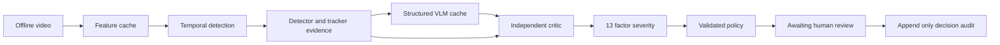

# System architecture

ARGUS uses one versioned Pydantic IncidentRecord. Each module owns one stage. Strict models reject extra keys and validate confidence ranges, claim identifiers and time ordering. Language output cannot contain top-level severity or response fields.

## Module contracts

M1 decodes video, resamples at 25 frames per second and groups 16 frames per snippet. Each snippet spans 0.64 seconds, not one second. Research extraction averages frozen CLIP frame features. The synthetic mode computes a small pixel vector plus motion. Cache keys include the source content hash, extractor name and preprocessing configuration. Sidecar JSON describes dimensions and temporal spacing.

M2 uses a four-layer temporal transformer with sinusoidal position encoding, snippet attention, LayerNorm and a Multiple Instance Learning objective. Top-k pooling, a bounded erasing loss, sparsity and smoothness regularization operate on video-level binary labels. Validation loss chooses the checkpoint. Real mode requires a checkpoint and emits a binary anomaly score with class Unclassified. Sample mode uses an explicitly named motion baseline. The current localizer returns the envelope of threshold crossings, which may bridge disjoint events.

M3 only visits the candidate window. Synthetic scenes use actual pixel segmentation; research mode loads DETR. Greedy one-to-one IoU association maintains clip-local track IDs with an age limit. Counts are maximum simultaneous detections, avoiding the mistaken equation of track fragments with unique people. Keyframes maximize detection density and motion subject to temporal spacing. Occlusion, detector misses and ID switches remain limitations.

M4 loads structured claims from a validated cache. The optional Qwen job constrains decoding through a JSON grammar, rejects schema violations and retries parsing at most twice after the first generation. A separate critic-triggered retry consumes at most one explicitly supplied retry cache. Both attempts remain in the record. The critic does not receive the generation prompt.

M5 checks the sentence and entity metadata, maps curated aliases, uses one-way hypernym support, checks simultaneous counts within the claimed interval, and rejects claims outside the detection window. Only a deliberately narrow presence/count sentence grammar can receive VERIFIED. Intent, movement, interactions, property damage and other uncheckable semantics are downgraded. The rule-based vocabulary is limited; it is not a complete natural-language entailment system. Critic decisions never add claim text.

M6 reads only VERIFIED OBSERVATION claims and their referenced detections. Rejected, inferred and uncertain claims contribute nothing. Six factors have automatic support; seven context or event factors are unavailable and remain zero with availability metadata. The score is the sum of nonnegative contributions, clipped at 100. Until a fit is supplied, reference weights are explicitly uncalibrated. The fitting tool uses fixed ordered cut points and a cumulative logistic objective plus score error, nonnegative weights and a total-weight cap. Human ratings and pipeline-extracted factors must be split before fitting.

M7 looks up the incident class and severity band, falls back to a generic policy for unclassified events, then validates against exactly twelve action tokens. Violation counts record invalid proposed tokens before stripping. A valid token does not establish that a recommendation is appropriate. No action executor exists.

## Persistence and failure behavior

SQLite stores records and independent annotation sessions. Confirm and dismiss require an operator identifier; dismiss also requires a note. A transaction updates state and appends a chained-hash audit entry. Triggers reject SQL updates and deletes to audit rows. This detects many accidental changes but does not resist an administrator replacing the database or dropping triggers. Research failures stop with explicit errors. Missing checkpoints never silently select the sample pipeline.

