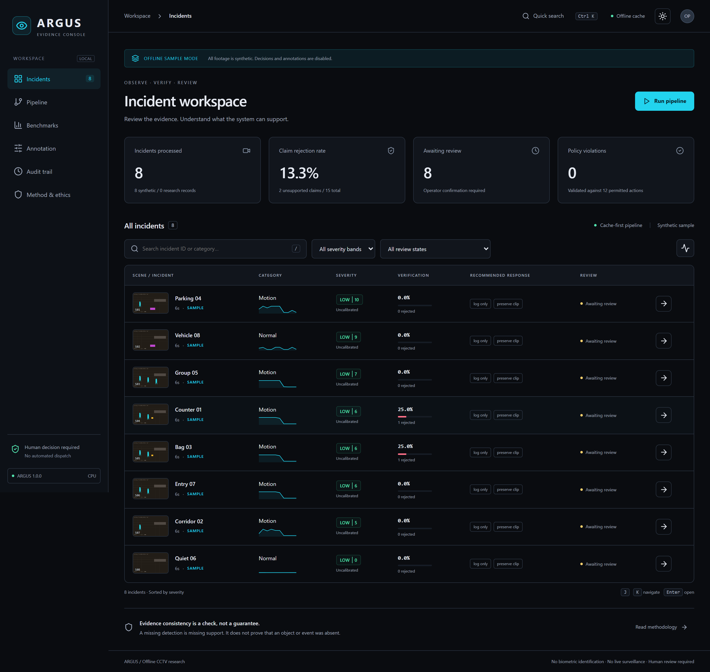

# ARGUS

Offline CCTV anomaly understanding with evidence checks, inspectable severity and human-reviewed recommendations.



**Runnable local research project.** Includes eight original synthetic video scenes, all seven pipeline modules, a React operator console, FastAPI, SQLite audit records, annotation tools, research training scripts, a 20-slide review deck and a detailed project guide. Sample footage, authored VLM claims and uncalibrated severity are labelled throughout.

## Start on Windows

Use Python 3.12 and Node.js 22. Open PowerShell in the extracted project folder:

```powershell
.\setup.ps1
.\start.ps1
```

Open **http://127.0.0.1:8000**. On this prepared machine, setup is already complete. Press Ctrl+C in the server terminal to stop.

If PowerShell blocks local scripts, run the equivalent commands in [docs/SETUP.md](SETUP.md). No machine-wide execution-policy change is required.

## Linux or macOS

```sh
python3.12 -m venv .venv
. .venv/bin/activate
make setup
make demo
make api
```

Setup downloads free software dependencies once. The installed sample pipeline and built console then work without internet or a GPU. `make demo` builds the sample and console, then exits. `make api` starts the application. A clean clone cannot install dependencies offline unless you supply a wheel and npm cache.

## Offline console

With the built console available, run `python -m http.server 8080 --directory apps/console/dist` and open `http://127.0.0.1:8080/?demo=1`. This mode reads cached sample records and videos without the FastAPI backend. It disables decisions and annotation writes.

## What is verified

See [docs/RESULTS.md](RESULTS.md), [artifacts/metrics.json](assets/metrics.json) and [docs/COMPLETION_STATUS.md](COMPLETION_STATUS.md). Research AUC, XD-Violence AP, human-calibrated severity, independent annotation agreement and 7B model benchmarks remain **PENDING** until their data and model jobs are supplied. No paper target is reported as an ARGUS measurement.

```sh
python -m pytest -q
python -m ruff check src scripts tests
python -m mypy src/argus/schema src/argus/modules --follow-imports=silent
python -m argus.cli eval
```

The sample uses a transparent motion baseline, colour segmentation and authored language fixtures. Research mode provides frozen CLIP features, a four-layer trainable temporal transformer, frozen DETR evidence and a Qwen VLM batch adapter. The detector is binary and reports `Unclassified` for real anomalies; it does not pretend binary labels train a 13-class recognizer. Geometric tracks are local associations and can switch during occlusion.

## Research positioning

Weakly supervised detection, CLIP features, VLM explanation and multi-step reasoning over surveillance video are established prior work. ARGUS investigates their combination with evidence consistency checks, inspectable human calibration, and a validated response vocabulary. The project does not claim novelty for those existing components or claim to be the first agentic system.

No facial recognition, biometric identification, cross-camera re-identification, automated dispatch or live streaming inference. Recommendations end in `AWAITING_HUMAN_CONFIRMATION`. Confirming records a review; it does not perform the recommended action. A detector miss means no supporting evidence, not proof of absence.

## Documentation

- [Setup and operation](SETUP.md)
- [Architecture](ARCHITECTURE.md)
- [API reference](API_REFERENCE.md)
- [Executed checks](TEST_REPORT.md)
- [Release contents and demo recording](RELEASE_NOTES.md)
- [Research workflows](RESEARCH_WORKFLOWS.md)
- [Input formats](DATA_FORMATS.md)
- [Annotation codebook](SIRB_ANNOTATION_PROTOCOL.md)
- [Ethics and model licences](ETHICS.md)
- [Verified literature metadata](literature/verified.json)
- [Phase completion and limitations](COMPLETION_STATUS.md)
- [Viva preparation](VIVA_PREP.md)

Team: Munis Aparji V S, Mithin Sagar S, Janit B. Guide: Dr. Premanand V. BCSE497J, School of Computer Science and Engineering, Vellore Institute of Technology.
